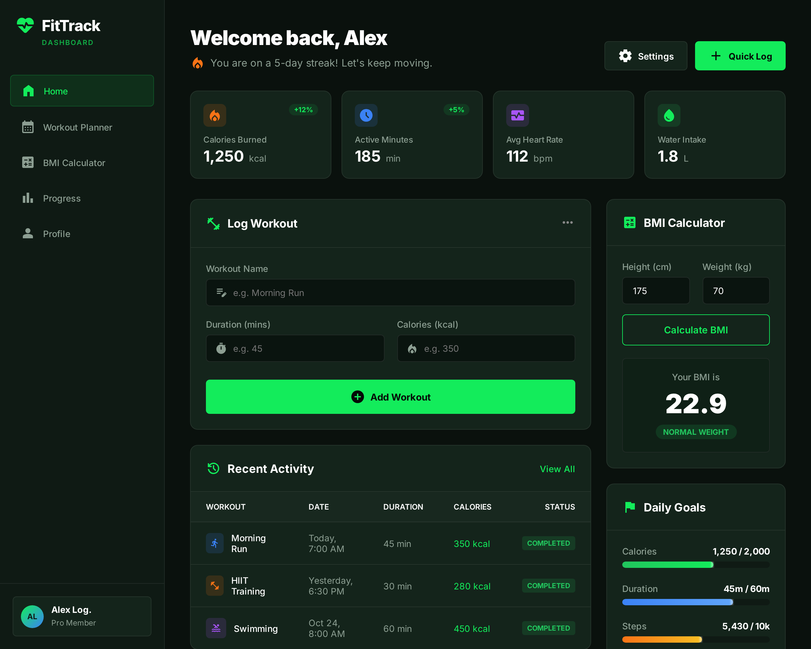
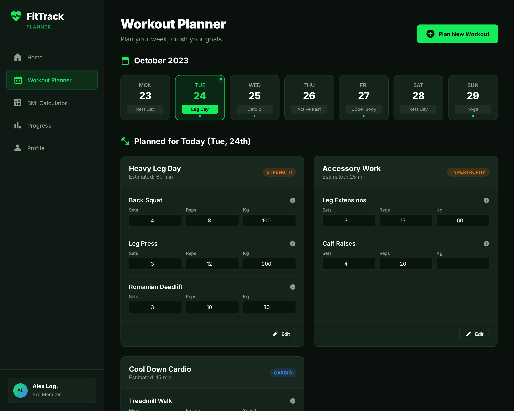
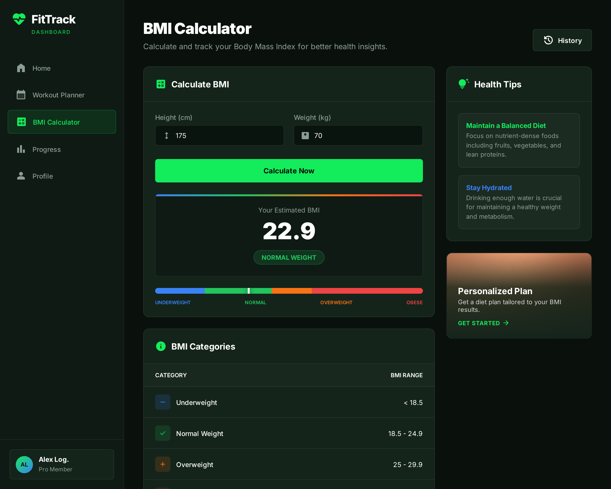
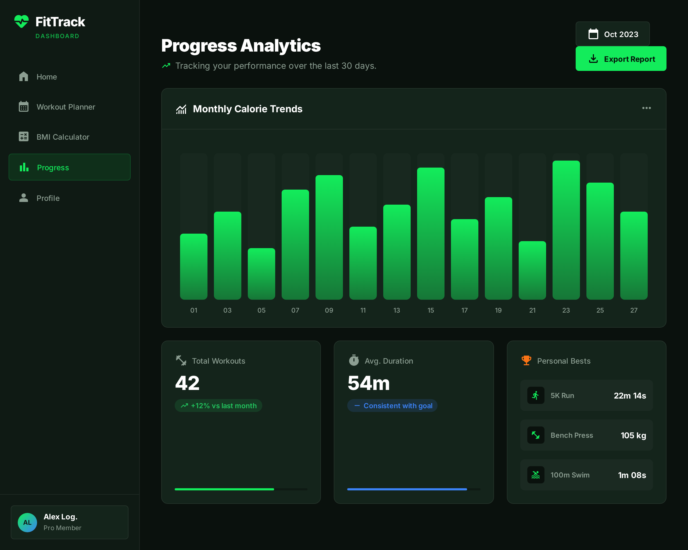
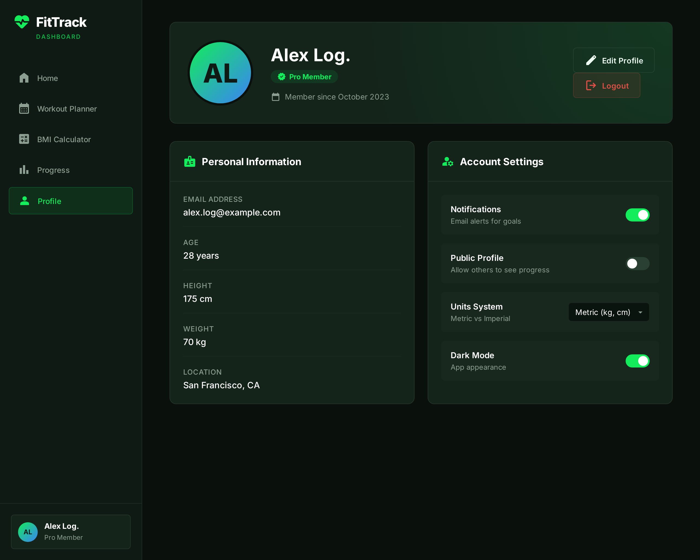

# 🏋️ Fitness Tracker Web App

A frontend-based **Fitness Tracker Web Application** built using **HTML, CSS (single global stylesheet), and Vanilla JavaScript**.
The project demonstrates dynamic UI updates, client-side authentication, and persistent data handling using `localStorage`.

---

## 🚀 Live Demo

👉 **Live Website:** [https://iamshkzahid.github.io/fitness-tracker](https://iamshkzahid.github.io/Fitness-Tracker)


---

## ✨ Features

* Login & Signup (client-side)
* Personalized Dashboard (dynamic username)
* Workout Planner (add & store workouts)
* BMI Calculator (real-time calculation)
* Progress Tracker
* Profile Page with Dark Mode
* Data persistence using `localStorage`

---

## 🛠 Tech Stack

* **HTML5**
* **CSS3** 
* **JavaScript**

---

## 📸 Screenshots

### Dashboard




### Workout Planner



### BMI Calculator



### Progress Page




### Profile Page



---

## 📁 Project Structure

```
├── index.html
├── Dashboard.html
├── Workout_Planner.html
├── BMI.html
├── Progress.html
├── Profile.html
├── styles.css
├── app.js
└── screenshots/
```

---

## 📌 Note

This is a **frontend-only academic project**.
All data is stored locally in the browser and no backend is used.

---

### 👨‍💻 Author

**Zahid Shaikh**
---
**Dayanand Jat**
---
**Utharsh Jaiswal**
---
**Ashwin Lal**
---
 
